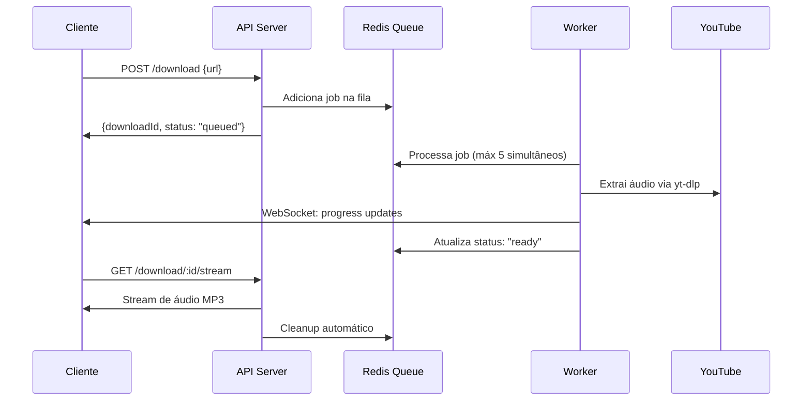

# 🎵 YouTube Audio Downloader

[](https://github.com/GabrielFinotti/YouTube-Audio-Downloader/actions)
[](https://opensource.org/licenses/MIT)
[](https://nodejs.org/)
[](https://www.typescriptlang.org/)

> API REST moderna para download de áudio do YouTube com sistema de filas, WebSocket em tempo real e arquitetura DDD.

## 🚀 Características

- ✅ **Download de alta qualidade** - MP3 na melhor qualidade disponível
- ✅ **Sistema de filas** - Máximo 5 downloads simultâneos com Redis
- ✅ **Tempo real** - Updates via WebSocket durante o processo
- ✅ **Streaming direto** - Arquivos enviados diretamente ao cliente
- ✅ **Arquitetura DDD** - Domain-Driven Design para máxima escalabilidade
- ✅ **TypeScript** - Type-safe em todo o projeto
- ✅ **Performance** - Otimizado para alta concorrência

## 📋 Índice

- [🎯 Fluxo de Funcionamento](#-fluxo-de-funcionamento)
- [🏗️ Arquitetura](#️-arquitetura)
- [🛠️ Tecnologias](#️-tecnologias)
- [⚙️ Instalação](#️-instalação)
- [🚀 Uso](#-uso)
- [📚 API Reference](#-api-reference)
- [🧪 Testes](#-testes)
- [🤝 Contribuição](#-contribuição)

## 🎯 Fluxo de Funcionamento



## 🏗️ Arquitetura

### Domain-Driven Design (DDD)

```
src/
├── domain/           # 🎯 Core business logic
│   ├── entities/     # Entidades principais
│   ├── valueObjects/ # Objetos de valor
│   ├── repositories/ # Interfaces dos repositórios
│   └── services/     # Serviços de domínio
├── application/      # 📋 Casos de uso
│   ├── useCases/     # Use cases
│   └── dtos/         # Data Transfer Objects
├── infrastructure/   # 🔧 Implementações externas
│   ├── repositories/ # Implementações dos repos
│   ├── services/     # Serviços externos
│   └── queue/        # Sistema de filas
└── presentation/     # 🌐 Camada de apresentação
    ├── controllers/  # Controllers REST
    ├── middlewares/  # Middlewares
    └── websocket/    # WebSocket handlers
```

## 🛠️ Tecnologias

### 📦 Dependências de Produção

#### 🌐 Framework Web & API

- **[Express.js 5.x](https://expressjs.com/)** - Framework web minimalista e rápido
  - **Por que?** Performance superior, async/await nativo, melhor tratamento de erros
  - **Como usar:** Framework base para nossa API REST

  - ```typescript
    import express from 'express';
    const app = express();
    ```

- **[Express Validator](https://express-validator.github.io/)** - Middleware de validação
  - **Por que?** Integração perfeita com Express, baseado no validator.js
  - **Como usar:** Validação de parâmetros e body das requisições

  - ```typescript
    import { body, validationResult } from 'express-validator';
    ```

- **[Express Rate Limit](https://github.com/express-rate-limit/express-rate-limit)** - Rate limiting
  - **Por que?** Proteção contra abuso e DoS attacks
  - **Como usar:** Limitação de requisições por IP/usuário

  - ```typescript
    import rateLimit from 'express-rate-limit';
    ```

- **[Helmet](https://helmetjs.github.io/)** - Segurança HTTP
  - **Por que?** Headers de segurança automáticos
  - **Como usar:** Middleware de segurança global

  - ```typescript
    import helmet from 'helmet';
    app.use(helmet());
    ```

- **[CORS](https://github.com/expressjs/cors)** - Cross-Origin Resource Sharing
  - **Por que?** Controle de acesso cross-origin
  - **Como usar:** Configuração de políticas CORS

  - ```typescript
    import cors from 'cors';
    app.use(cors());
    ```

- **[Compression](https://github.com/expressjs/compression)** - Compressão gzip
  - **Por que?** Reduz tamanho das respostas HTTP
  - **Como usar:** Middleware de compressão automática

  - ```typescript
    import compression from 'compression';
    app.use(compression());
    ```

#### 🔄 Sistema de Filas

- **[BullMQ](https://docs.bullmq.io/)** - Sistema de filas moderno
  - **Por que?** TypeScript-first, performance superior ao Bull clássico, features avançadas
  - **Como usar:** Gerenciamento de jobs de download

  - ```typescript
    import { Queue, Worker } from 'bullmq';
    const downloadQueue = new Queue('download');
    ```

- **[Redis](https://github.com/redis/node-redis)** - Cliente Redis oficial
  - **Por que?** Cliente oficial, suporte completo ao Redis 7+
  - **Como usar:** Conexão principal com Redis

  - ```typescript
    import redis from 'redis';
    const client = redis.createClient();
    ```

- **[IORedis](https://github.com/redis/ioredis)** - Cliente Redis alternativo
  - **Por que?** Performance superior, suporte a cluster, reconnect automático
  - **Como usar:** Para operações de alta performance

  - ```typescript
    import IORedis from 'ioredis';
    const redis = new IORedis();
    ```

#### 📡 WebSocket

- **[Socket.IO](https://socket.io/)** - WebSocket em tempo real
  - **Por que?** Fallback automático, rooms, namespaces, reconnect
  - **Como usar:** Updates em tempo real para o cliente

  - ```typescript
    import { Server } from 'socket.io';
    const io = new Server(server);
    ```

#### 🎵 Download de Áudio

- **[@distube/ytdl-core](https://github.com/distubejs/ytdl-core)** - YouTube downloader
  - **Por que?** Fork otimizado do ytdl-core, melhor performance
  - **Como usar:** Extração de streams de áudio do YouTube

  - ```typescript
    import ytdl from '@distube/ytdl-core';
    const info = await ytdl.getInfo(url);
    ```

- **[yt-dlp-wrap](https://github.com/foxesdocode/yt-dlp-wrap)** - Wrapper do yt-dlp
  - **Por que?** Alternativa robusta, suporte a mais sites, atualizações frequentes
  - **Como usar:** Backup para URLs complexas

  - ```typescript
    import YTDlpWrap from 'yt-dlp-wrap';
    const ytDlpWrap = new YTDlpWrap();
    ```

- **[fluent-ffmpeg](https://github.com/fluent-ffmpeg/node-fluent-ffmpeg)** - Manipulação de áudio
  - **Por que?** Interface amigável para FFmpeg, suporte completo a formatos
  - **Como usar:** Conversão e processamento de áudio

  - ```typescript
    import ffmpeg from 'fluent-ffmpeg';
    ffmpeg(input).toFormat('mp3');
    ```

#### 🔧 Utilitários & Validação

- **[Zod](https://zod.dev/)** - Schema validation
  - **Por que?** TypeScript-first, inferência de tipos, performance superior
  - **Como usar:** Validação de schemas e DTOs

  - ```typescript
    import { z } from 'zod';
    const schema = z.object({ url: z.string().url() });
    ```

- **[Class Validator](https://github.com/typestack/class-validator)** - Validação baseada em decorators
  - **Por que?** Integração com class-transformer, decorators elegantes
  - **Como usar:** Validação de entidades e DTOs

  - ```typescript
    import { IsUrl, IsOptional } from 'class-validator';
    ```

- **[UUID](https://github.com/uuidjs/uuid)** - Geração de UUIDs
  - **Por que?** Padrão da indústria, múltiplas versões
  - **Como usar:** IDs únicos para downloads

  - ```typescript
    import { v4 as uuidv4 } from 'uuid';
    const id = uuidv4();
    ```

- **[Nanoid](https://github.com/ai/nanoid)** - Geração de IDs curtos
  - **Por que?** Mais compacto que UUID, URL-safe
  - **Como usar:** IDs curtos para URLs públicas

  - ```typescript
    import { nanoid } from 'nanoid';
    const id = nanoid();
    ```

#### 🏗️ Dependency Injection

- **[TSyringe](https://github.com/microsoft/tsyringe)** - DI Container
  - **Por que?** Microsoft, decorators simples, TypeScript-first
  - **Como usar:** Injeção de dependências na arquitetura DDD

  - ```typescript
    import { injectable, inject } from 'tsyringe';
    @injectable()
    class Service { }
    ```

### 🧪 Dependências de Desenvolvimento

#### 📝 Build & TypeScript

- **[TypeScript](https://www.typescriptlang.org/)** - Linguagem principal
  - **Por que?** Type safety, melhor DX, escalabilidade
  - **Como usar:** Linguagem base do projeto

- **[tsx](https://github.com/esbuild-kit/tsx)** - TypeScript runner
  - **Por que?** Execução direta de TypeScript, performance superior ao ts-node
  - **Como usar:** Desenvolvimento com hot reload

  - ```bash
    npm run dev  # usa tsx src/index.ts
    ```

- **[tsup](https://tsup.egoist.dev/)** - Build tool moderna
  - **Por que?** ESBuild-based, extremamente rápido, zero config para TS
  - **Como usar:** Build otimizado para produção

  - ```bash
    npm run build  # gera dist/ otimizado
    ```

#### 🎨 Code Quality

- **[ESLint](https://eslint.org/)** - Linting
  - **Por que?** Padrão da indústria, extensível, TypeScript support
  - **Como usar:** Análise estática de código

  - ```bash
    npm run lint
    ```

- **[Prettier](https://prettier.io/)** - Code formatting
  - **Por que?** Formatação automática, zero config
  - **Como usar:** Formatação consistente

  - ```bash
    npm run format
    ```

#### 🔄 Git Hooks & Standards

- **[Husky](https://typicode.github.io/husky/)** - Git hooks
  - **Por que?** Git hooks simples e confiáveis
  - **Como usar:** Pre-commit hooks automáticos

- **[lint-staged](https://github.com/okonet/lint-staged)** - Lint arquivos staged
  - **Por que?** Performance, lint apenas arquivos modificados
  - **Como usar:** Lint automático no commit

- **[Commitlint](https://commitlint.js.org/)** - Padronização de commits
  - **Por que?** Conventional commits, consistency
  - **Como usar:** Validação automática de mensagens

#### 🧪 Testing

- **[Jest](https://jestjs.io/)** - Framework de testes
  - **Por que?** Padrão da indústria, snapshot testing, mocking
  - **Como usar:** Testes unitários e integração

  - ```bash
    npm test
    ```

- **[Supertest](https://github.com/ladjs/supertest)** - Testes de API
  - **Por que?** Testing HTTP endpoints, integração com Jest
  - **Como usar:** Testes E2E da API

## ⚙️ Instalação

### Pré-requisitos

- **Node.js** ≥ 18.0.0
- **Redis** ≥ 7.0.0
- **FFmpeg** (para conversão de áudio)

### 1. Clone o repositório

```bash
git clone https://github.com/GabrielFinotti/YouTube-Audio-Downloader.git
cd YouTube-Audio-Downloader
```

### 2. Instale as dependências

```bash
npm install
```

### 3. Configure as variáveis de ambiente

```bash
cp .env.example .env
```

Edite o arquivo `.env`:

```env
# Server
PORT=3000
NODE_ENV=development

# Redis
REDIS_URL=redis://localhost:6379
REDIS_PASSWORD=

# Queue
MAX_CONCURRENT_DOWNLOADS=5
JOB_TTL_MINUTES=60

# Audio
DEFAULT_AUDIO_FORMAT=mp3
DEFAULT_QUALITY=best

# Security
RATE_LIMIT_WINDOW_MS=900000
RATE_LIMIT_MAX_REQUESTS=100
```

### 4. Execute em modo desenvolvimento

```bash
npm run dev
```

### 5. Build para produção

```bash
npm run build
npm start
```

## 🚀 Uso

### Iniciar um download

```bash
curl -X POST http://localhost:3000/api/download \
  -H "Content-Type: application/json" \
  -d '{"url": "https://www.youtube.com/watch?v=dQw4w9WgXcQ"}'
```

Response:

```json
{
  "downloadId": "abc123",
  "status": "queued",
  "estimatedTime": "30s"
}
```

### Conectar ao WebSocket para updates

```javascript
import io from 'socket.io-client';

const socket = io('http://localhost:3000');
socket.emit('join-download', 'abc123');

socket.on('download-progress', (data) => {
  console.log(`Progress: ${data.percentage}%`);
  console.log(`Status: ${data.status}`);
});
```

### Baixar o arquivo quando pronto

```bash
curl http://localhost:3000/api/download/abc123/stream \
  --output audio.mp3
```

## 📚 API Reference

### POST /api/download

Inicia um novo download de áudio.

**Body:**

```json
{
  "url": "string (required) - URL do YouTube",
  "format": "string (optional) - Formato do áudio (default: mp3)",
  "quality": "string (optional) - Qualidade (best|worst|128|192|256|320)"
}
```

**Response:**

```json
{
  "downloadId": "string - ID único do download",
  "status": "queued|processing|completed|failed",
  "estimatedTime": "string - Tempo estimado"
}
```

### GET /api/download/:id/status

Verifica o status de um download.

**Response:**

```json
{
  "downloadId": "string",
  "status": "queued|processing|completed|failed",
  "progress": "number - Porcentagem (0-100)",
  "metadata": {
    "title": "string",
    "duration": "number",
    "thumbnail": "string"
  }
}
```

### GET /api/download/:id/stream

Faz download do arquivo de áudio.

**Headers:**

- `Range` (optional) - Para download resumível

**Response:**

- Stream binário do arquivo MP3
- Headers apropriados para download

### WebSocket Events

**Client → Server:**

- `join-download` - Se inscrever em updates de um download
- `leave-download` - Cancelar inscrição

**Server → Client:**

- `download-progress` - Update de progresso
- `download-completed` - Download finalizado
- `download-failed` - Erro no download

## 🧪 Testes

```bash
# Testes unitários
npm test

# Testes com watch mode
npm run test:watch

# Coverage report
npm run test:coverage

# Lint
npm run lint

# Type checking
npm run type-check
```

## 🤝 Contribuição

1. Fork o projeto
2. Crie uma branch para sua feature (`git checkout -b feature/amazing-feature`)
3. Commit suas mudanças (`git commit -m 'feat: add amazing feature'`)
4. Push para a branch (`git push origin feature/amazing-feature`)
5. Abra um Pull Request

### Convenções

- **Commits:** [Conventional Commits](https://www.conventionalcommits.org/)
- **Code Style:** Prettier + ESLint
- **Testes:** Obrigatórios para novas features

## 📄 Licença

Este projeto está sob a licença MIT. Veja o arquivo [LICENSE](LICENSE) para mais detalhes.

## 🙏 Agradecimentos

- [yt-dlp](https://github.com/yt-dlp/yt-dlp) - Ferramenta incrível para download
- [FFmpeg](https://ffmpeg.org/) - Processamento de mídia
- [BullMQ](https://docs.bullmq.io/) - Sistema de filas robusto

---

**[⬆ Voltar ao topo](#-youtube-audio-downloader)**
